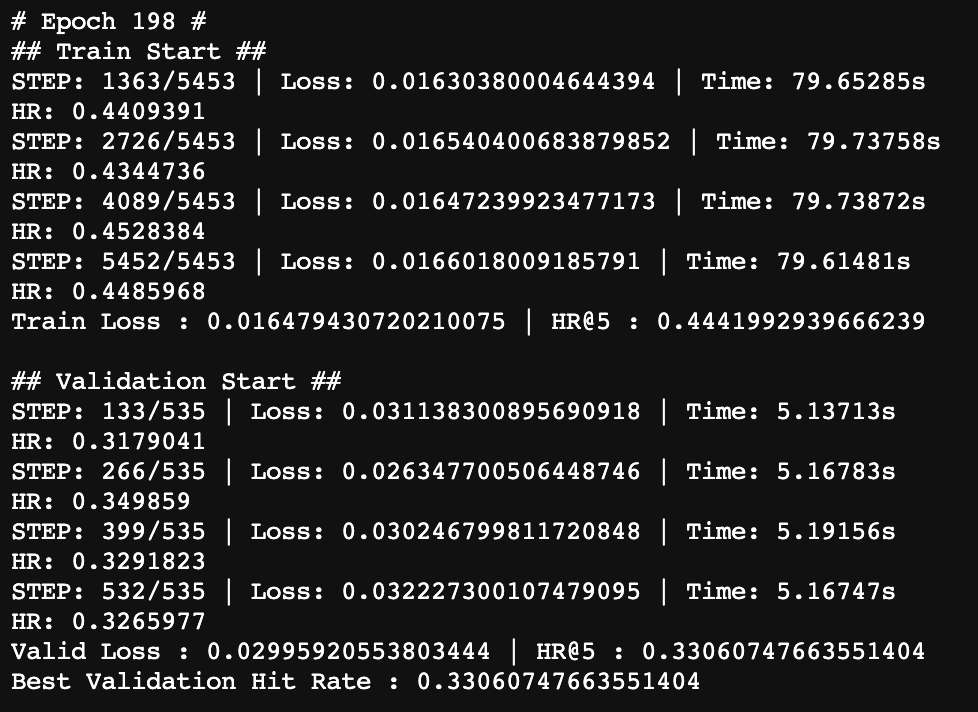

# GRU4REC for MovieLens 1M
GRU4REC training code based on paper :  
Session-Based Recommendations with Recurrent Neural Network (ICLR 2016)

Applying MovieLens 1M dataset.

 

## Code
Entry file
- run.py

 

## Data Preprocessing
As MovieLens dataset is little bit different from the dataset that the paper uses, I make sequential movie input.  
The ratings of MovieLens dataset varies from 1 to 5.  
I assumed that even though the user scores 1 on the movie, there was an interaction which can be used as a recommendation evidence.  
Therfore I use all rating data in MovieLens.  

 

## Result
The performance of the model is measured through hit rate of top 5 items.  
As I make validation set, it records 0.33 hit rate score.  

